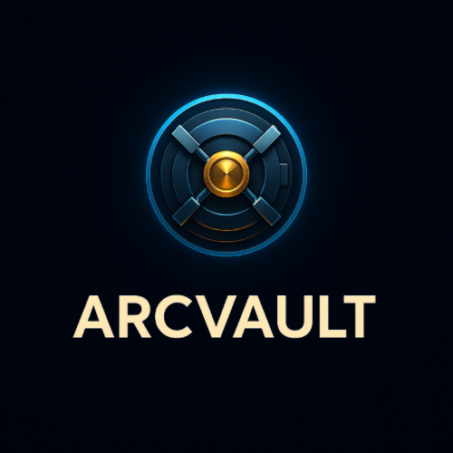

  

  <h1>ArcVault Contribution NFT <code>v1.0.4 – Testnet Only</code></h1>
  <i>Secure & Upgradeable NFT Infra for On-Chain Contribution Recognition</i>

  
  
  

> ⚠️ Do not use on mainnet. No private keys, seeds, or API keys should ever be committed to this repository.

  <b>ArcVault Contribution NFT — Pre-launch / Testnet Only</b> 
  Security hardening in progress. Contracts and roles are not final.

---

**Status:** Pre-launch (Testnet only)  
**Privileged roles:** SIGNER_ROLE / POLICY_ADMIN / METADATA_ADMIN / UPGRADER_ROLE → **TBD (to be assigned via multisig + timelock before mainnet)**

---

## 📍 Why / Use Case

### Why ArcVault Contribution NFT?
Traditional methods of recognizing open-source or community contributions—such as off-chain leaderboards, forum posts, or centralized badges—are non-verifiable, easily manipulated, and rarely portable across projects or ecosystems. ArcVault Contribution NFT solves this problem by turning every meaningful on-chain or off-chain contribution into a secure, upgradeable, and verifiable NFT badge backed by cryptographic proof.

With ArcVault, individual contributors, DAOs, enterprises, and developer communities can transparently track, verify, and reward all forms of contributions—code, security, research, community building, outreach—on any EVM-compatible chain.

---

### Use Cases
- **Open Source DAOs & Protocols:** Reward developers and active community members with non-transferable (Soulbound) NFTs that represent unique, verifiable contributions.  
- **Enterprise & Team Environments:** Issue digitally signed, immutable contribution records for employees or external collaborators.  
- **Event and Community Recognition:** Distribute NFT-based badges for hackathon participation, event organization, public speaking, or ambassador programs.  
- **Growth Campaigns & Ambassadorships:** Track marketing, outreach, or onboarding contributions on-chain.  
- **Reputation and Attestation:** Integrate verifiable contribution history for governance, voting rights, incentives, or access control.  

---

**In summary:**  
ArcVault is the missing, secure, and upgradeable layer for turning any on-chain or off-chain contribution into a portable, provable achievement that strengthens your project’s transparency, reputation, and incentives.

---

## 🚀 Key Features

- **Contribution Recording Mechanism:** On-chain contribution records using EIP-712 signatures; supports EOAs + EIP-1271.  
- **Reward System:** Contributions represented as NFTs; compatible with incentives or token rewards.  
- **Flexible NFT Infrastructure:** ERC-721, ERC-2981 (royalty), ERC-4906 (metadata updates).  
- **Advanced Security:** Role-based access control, pausable, UUPS upgradeable, per-token freeze, Soulbound mode.  
- **Full Transparency:** All contribution data (approver, category, score, CID) queryable on-chain.  
- **Policy Flexibility:** Dynamic role assignments; customizable signer sets.  

---

## 📌 Types of Contributions

### 🛠 Technical Contributions
- Smart contract development & optimization  
- dApp deployment  
- Bug bounties & security patches  
- Testnet / mainnet testing  
- Protocol upgrades  

### 🌐 Community Contributions
- Organizing events, workshops, AMAs  
- Creating educational content  
- Managing community channels  
- Translating documentation  

### 📢 Outreach & Growth
- Videos, podcasts, infographics  
- Marketing campaigns  
- Partnerships & integrations  
- Social media growth  

### 🔍 Research & Development
- Security audits  
- Governance improvements  
- Ecosystem strategy design  
- Market/user research  

---

## 📊 Technical Specs

| Feature           | Supported | Description                       |
|-------------------|-----------|-----------------------------------|
| ERC-721           | ✅         | Fully compliant                   |
| ERC-2981          | ✅         | Royalty reporting                 |
| ERC-4906          | ✅         | Metadata update signaling         |
| EIP-712           | ✅         | Signed contribution & update      |
| Soulbound Mode    | ✅         | Transfer/approval disabled        |
| Freeze (Per Token)| ✅         | Permanent metadata lock           |
| UUPS Upgrade      | ✅         | Controlled upgrade                 |
| Pausable          | ✅         | Emergency stop                    |
| EIP-1271          | ✅         | Multisig / corporate signatures   |
| EAS Attestation   | Optional  | Off-chain verification bridge     |

---

## 🔐 Deployment / Roles

> **Note:** These addresses are placeholders for pre-launch/testnet only. Replace with actual addresses before mainnet deployment.

| Role              | Address (Placeholder)       | Description |
|-------------------|-----------------------------|-------------|
| `SIGNER_ROLE`     | `0x0000000000000000000000000000000000000000` | Signs verified contributions (multisig recommended). |
| `POLICY_ADMIN`    | `0x0000000000000000000000000000000000000000` | Controls pause/SBT toggle; assign to multisig + timelock. |
| `METADATA_ADMIN`  | `0x0000000000000000000000000000000000000000` | Can update metadata before freeze. |
| `UPGRADER_ROLE`   | `0x0000000000000000000000000000000000000000` | Controls contract upgrades. |

📌 **Security Tip:** Use Gnosis Safe multisigs with `TimelockController` (24–48h) for POLICY_ADMIN & UPGRADER_ROLE.

---

## 🧪 Deployment

### Testnet Setup
1. Deploy contracts to desired EVM testnet.  
2. Assign roles using placeholder addresses above.  

---

## 🧩 CI / Security

- PRs run tests, coverage & Slither static analysis.  
- No secrets in repo; use `.env` (testnet only).  
- See `SECURITY.md` for disclosure policy.  

---

## 🧾 Examples

EIP-712 signing snippets in `examples/`:  
- `sign-mint.ts` → payload for `mintWithSig`  
- `sign-update.ts` → payload for `updateWithSig`  

---

## 🤝 Contributing

We welcome contributions from developers, researchers, designers, PMs, writers, and ecosystem builders.  
Please read our [Contributing Guide](.github/CONTRIBUTING.md) before PRs.  

---

🛡️ **Developer Disclaimer**  
This project is for research/educational purposes only. Testnet-only. Contracts, scoring models, and role assignments may change.  

🚫 **No Guarantee of Rewards/Support**  
- No guaranteed tokens, airdrops, or compensation.  
- Contributions are voluntary.  
- No obligation for development, maintenance, or launch.  
- Provided “as is” (see LICENSE).  

⚠️ **Liability & Attribution**  
- Maintainer assumes no legal/financial responsibility for forks or unauthorized use.  
- Use must include attribution under MIT License.

  ---

## ⚖️ Legal Disclaimer

This repository and its associated smart contracts, code, documentation, or related materials are provided strictly for **research and educational purposes only**.  

By accessing, forking, deploying, or otherwise using this repository, you agree to the following terms:

1. **No Investment Contract**  
   - Nothing in this repository, its code, or related discussions constitutes an investment contract, security, or financial instrument.  
   - No party should interpret the publication of this code as a solicitation for investment, financial advice, or a guarantee of future value.  

2. **No Warranty / Liability**  
   - The code is provided *“AS IS”*, without warranty of any kind.  
   - The maintainers assume **no responsibility** for damages, data loss, vulnerabilities, exploits, or any misuse.  
   - Users bear **full risk and liability** for any deployment, integration, or derivative work.  

3. **No Rewards, No Obligations**  
   - There is no guarantee of tokens, airdrops, retroactive rewards, or compensation of any form.  
   - Contributions to this repository are entirely voluntary and do not create any contractual rights or obligations.  
   - The maintainers may pause, discontinue, or terminate the project at any time without notice or liability.  

4. **Jurisdiction & Applicable Law**  
   - This repository and its maintainers do not assume legal responsibility in any jurisdiction.  
   - Any claims or disputes must be resolved under the principles of **applicable open-source licensing (MIT)**.  

5. **Attribution Requirement**  
   - Any usage, deployment, or derivative work must include clear attribution to the original author(s) as specified in the MIT License.  
   - Misrepresentation, plagiarism, or unauthorized branding of this code is strictly prohibited.  

Freeze guarantees metadata immutability within the current implementation;
upgrades are governed by explicit multisig + timelock policies.

Contribution scoring is intentionally subjective and policy-defined;
ArcVault does not claim objective reputation measurement.

Soulbound mode is configurable per deployment and not enforced globally.

**Summary:**  
Use at your own risk. No warranty, no guarantee of rewards, no financial responsibility. This is a research/educational repository, not a commercial product or investment vehicle.
